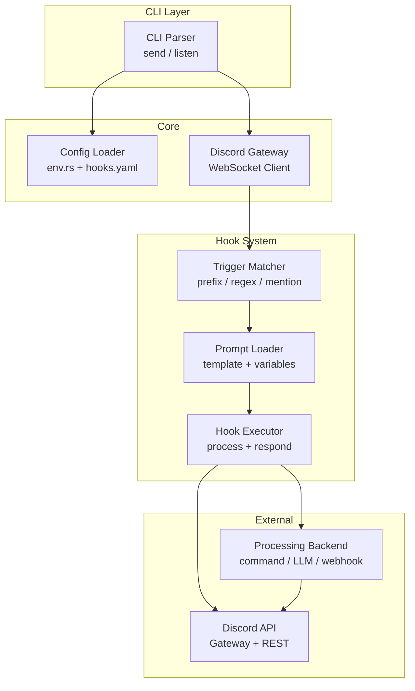

# Discord Channel Message Hook System - Implementation Plan

## Overview

This document outlines the technical implementation plan for adding a **channel message hook system** to the existing `discli` Discord CLI tool. The feature will enable the application to:
1. Listen for messages in a configured Discord channel via WebSocket (Gateway)
2. Trigger custom "hooks" when messages are received
3. Process messages using preconfigured prompt files
4. Provide extensible automation capabilities

---

## 1. Technical Approach

### 1.1 Gateway vs. Polling

| Approach | Pros | Cons |
|----------|------|------|
| **Discord Gateway (Recommended)** | Real-time, low latency, official Discord pattern, supports all event types | More complex, requires WebSocket connection, needs session management |
| **REST API Polling** | Simpler to implement, uses existing HTTP client | High latency, rate-limited, inefficient for real-time response |

**Decision**: Use **Discord Gateway** via a dedicated library. It's the official Discord-recommended approach and provides the responsiveness required for a hook system.

### 1.2 Library Recommendations

#### Option A: `twilight` (Recommended)
- **Pros**: 
  - Pure Rust, no runtime dependencies
  - Well-maintained, actively developed
  - Comprehensive Gateway and REST support
  - Modular (can use just what needed)
- **Cons**: 
  - Larger dependency footprint
  - Steeper learning curve

#### Option B: `serenity`
- **Pros**:
  - Most popular Discord library for Rust
  - Mature, well-documented
  - Large community
- **Cons**:
  - Tied to `tokio` runtime
  - Larger binary size

#### Option C: `agora` / `biscuit`
- Lightweight alternatives
- Less mature ecosystems

**Decision**: Use **`twilight`** as it integrates well with the existing `tokio` runtime and provides a modular approach that aligns with the project's current architecture.

---

## 2. Architecture Changes

### 2.1 New Module Structure

```
src/
├── cli.rs                    # Add new "listen" subcommand
├── config/
│   ├── env.rs                # Add hook configuration fields
│   └── mod.rs
├── discord/
│   ├── client.rs             # Add Gateway client for listening
│   ├── gateway.rs            # NEW: WebSocket connection handling
│   ├── types.rs              # Add Gateway event types
│   └── mod.rs
├── hooks/                    # NEW: Hook system module
│   ├── mod.rs
│   ├── config.rs             # Hook configuration management
│   ├── loader.rs             # Prompt file loader
│   ├── trigger.rs            # Message trigger matching
│   └── executor.rs           # Hook execution engine
├── prompt/                   # NEW: Prompt file handling
│   ├── mod.rs
│   ├── loader.rs             # Load prompt templates
│   ├── variables.rs          # Variable substitution (e.g., {{message}})
│   └── registry.rs           # Available prompt registry
├── commands/
│   ├── mod.rs
│   ├── send.rs
│   ├── image.rs
│   └── listen.rs             # NEW: Listen command
└── main.rs                   # Update entry point for long-running mode
```

### 2.2 Core Components

#### Gateway Client (`src/discord/gateway.rs`)
- Manages WebSocket connection to Discord
- Handles event dispatching (MESSAGE_CREATE, etc.)
- Implements reconnection logic and heartbeat
- Runs as a background task

#### Hook Configuration (`src/hooks/config.rs`)
```rust
/// Hook configuration loaded from config file
pub struct HookConfig {
    /// Unique identifier for this hook
    pub id: String,
    /// Channel IDs to listen on (can be multiple)
    pub channels: Vec<u64>,
    /// Trigger conditions (message starts with, contains, regex, etc.)
    pub trigger: TriggerConfig,
    /// Path to prompt file to use
    pub prompt_file: PathBuf,
    /// Optional: filter by user ID or role
    pub filter: Option<FilterConfig>,
    /// Action to take after processing
    pub action: HookAction,
}

/// Trigger configuration for when to fire a hook
pub enum TriggerConfig {
    /// Trigger on any message in channel
    Any,
    /// Trigger when message starts with prefix
    Prefix(String),
    /// Trigger when message contains substring
    Contains(String),
    /// Trigger when regex matches
    Regex(Regex),
    /// Trigger on mentions of bot
    Mention,
}

/// Action to perform when hook triggers
pub enum HookAction {
    /// Process and send response to channel
    Reply,
    /// Process via prompt and send DM to user
    SendDm,
    /// Process and send to a different channel
    Forward(u64),
    /// Custom webhook URL
    Webhook(String),
}
```

#### Prompt System (`src/prompt/`)
```rust
/// Prompt template with variable placeholders
pub struct PromptTemplate {
    /// Template content with {{variable}} placeholders
    pub content: String,
    /// Available variables for this template
    pub variables: Vec<String>,
}

/// Variables extracted from a Discord message
pub struct MessageVariables {
    pub content: String,
    pub author_id: String,
    pub author_name: String,
    pub channel_id: String,
    pub message_id: String,
    pub timestamp: String,
    pub attachments: Vec<String>,
    pub embeds: Vec<String>,
}
```

---

## 3. Data Structures

### 3.1 Hook Configuration File Format (YAML)

Create `hooks.yaml` in project root or config directory:

```yaml
# hooks.yaml
version: "1.0"

# Global settings
settings:
  # Error handling
  on_error: "log"  # Options: log, ignore, notify
  
  # Rate limiting
  rate_limit:
    per_user: 5      # Max triggers per user
    per_channel: 10  # Max triggers per channel
    window_seconds: 60

# Hook definitions
hooks:
  - id: "ai-respond"
    name: "AI Response Hook"
    enabled: true
    
    # Listen on these channels
    channels:
      - "123456789012345678"  # Channel ID
    
    # Trigger conditions
    trigger:
      type: "mention"  # When bot is mentioned
      # Or: prefix: "!"
      # Or: contains: "hello"
      # Or: regex: "^!ask\\s+(.+)$"
    
    # Prompt file to use
    prompt_file: "./prompts/ai-response.txt"
    
    # Optional: only trigger for specific users/roles
    filter:
      # users: ["123456789"]
      # roles: ["987654321"]
    
    # Response action
    action:
      type: "reply"  # Reply in channel
      # Or: dm, forward, webhook
    
    # Processing config
    processing:
      timeout_seconds: 30
      # Optional: command to execute with message as stdin
      # Or: call external API
      
# Prompt templates directory
prompts_dir: "./prompts"
```

### 3.2 Prompt File Format

Prompt files are simple text files with variable placeholders:

```
# File: prompts/ai-response.txt
You are a helpful Discord assistant. A user sent the following message:

User: {{author_name}}
Message: {{content}}
Timestamp: {{timestamp}}

Please respond helpfully to this message. Be concise and friendly.
```

**Available Variables**:
| Variable | Description |
|----------|-------------|
| `{{content}}` | Full message content |
| `{{author_id}}` | User's Discord ID |
| `{{author_name}}` | User's username#discriminator |
| `{{channel_id}}` | Channel ID where message was sent |
| `{{message_id}}` | Message ID |
| `{{timestamp}}` | Message timestamp (ISO 8601) |
| `{{attachments}}` | List of attachment filenames |
| `{{embeds}}` | Number of embeds in message |

---

## 4. Implementation Phases

### Phase 1: Gateway Integration (Foundation)
**Goal**: Establish WebSocket connection and receive events

- [ ] Add `twilight` dependency to `Cargo.toml`
- [ ] Create `src/discord/gateway.rs` module
- [ ] Implement `GatewayClient` struct with:
  - WebSocket connection management
  - Event deserialization (MESSAGE_CREATE, etc.)
  - Heartbeat handling
  - Reconnection logic
- [ ] Add `DiscordGateway` error variants to `error.rs`
- [ ] Create basic test for Gateway connection

**Dependencies**: None (foundation work)

---

### Phase 2: Configuration System
**Goal**: Add hook configuration support

- [ ] Add `serde_yaml` and `regex` dependencies
- [ ] Extend `Config` in `src/config/env.rs`:
  - Add optional `HOOKS_FILE` env var
  - Add `HOOK_ENABLED` flag
- [ ] Create `src/hooks/config.rs`:
  - Implement `HookConfig` deserialization
  - Add validation (channels exist, prompt files exist)
- [ ] Add `on_error` and `rate_limit` settings
- [ ] Create `hooks.yaml` example file

**Dependencies**: Phase 1 (Gateway types needed for event handling)

---

### Phase 3: Prompt File System
**Goal**: Load and process prompt templates

- [ ] Create `src/prompt/` module
- [ ] Implement `PromptLoader`:
  - Load `.txt` files from configured directory
  - Parse variable placeholders
  - Validate template syntax
- [ ] Implement `MessageVariables` extraction from Discord events
- [ ] Implement variable substitution:
  - Replace `{{variable}}` with actual values
  - Handle missing variables gracefully
- [ ] Create sample prompt files in `./prompts/` directory

**Dependencies**: Phase 2 (configuration for prompts_dir)

---

### Phase 4: Hook Execution Engine
**Goal**: Match triggers and execute hooks

- [ ] Create `src/hooks/trigger.rs`:
  - Implement `TriggerMatcher` trait
  - Implement: Prefix, Contains, Regex, Mention matchers
- [ ] Create `src/hooks/executor.rs`:
  - Load prompt with variables
  - Execute processing (external command or placeholder for AI)
  - Send response based on `HookAction`
- [ ] Implement rate limiting:
  - Per-user, per-channel tracking
  - Sliding window algorithm
- [ ] Add logging for hook triggers

**Dependencies**: Phase 2 + Phase 3 (config + prompts)

---

### Phase 5: CLI Integration
**Goal**: Expose hook system via CLI

- [ ] Add new `listen` subcommand to `src/cli.rs`:
  ```rust
  Listen {
      /// Run in foreground (Ctrl+C to stop)
      #[arg(long, default_value = "false")]
      foreground: bool,
      
      /// Install as system service (future)
      #[arg(long)]
      install: bool,
  }
  ```
- [ ] Create `src/commands/listen.rs`:
  - Load hook configuration
  - Initialize Gateway client
  - Start event loop
  - Register hook handlers
- [ ] Update `src/main.rs`:
  - Add `--daemon` / `--foreground` flag handling
  - Graceful shutdown signal handling
- [ ] Add SIGINT/SIGTERM handlers for clean shutdown

**Dependencies**: Phase 4 (hook execution engine)

---

### Phase 6: Processing Backend (Extensible)
**Goal**: Actual message processing (AI, automation)

This phase is intentionally left extensible. Options include:

1. **Command Execution**: Spawn external process with prompt as stdin
2. **LLM API Integration**: Call OpenAI/Anthropic APIs
3. **Custom Scripting**: Run Python/Shell scripts
4. **HTTP Webhook**: Send to custom endpoint

For initial implementation, recommend a **command execution** approach:
```rust
pub enum Processor {
    Command(Vec<String>),  // ["/path/to/script.sh", "--input"]
    // Future: Llm(LLMConfig),
}

impl Processor {
    pub async fn execute(&self, prompt: &str) -> Result<String> {
        match self {
            Command(cmd) => {
                // Spawn process, write prompt to stdin
                // Read stdout as response
            }
        }
    }
}
```

**Dependencies**: Phase 5 (CLI integration)

---

## 5. Configuration Changes

### 5.1 New Environment Variables

| Variable | Required | Default | Description |
|----------|----------|---------|-------------|
| `DISCORD_TOKEN` | Yes | - | Bot token (existing) |
| `DISCORD_CHANNEL_ID` | Yes | - | Default channel (existing) |
| `HOOK_ENABLED` | No | `false` | Enable hook system |
| `HOOKS_FILE` | No | `./hooks.yaml` | Path to hooks configuration |
| `PROMPTS_DIR` | No | `./prompts` | Directory for prompt templates |
| `LOG_LEVEL` | No | `info` | Logging verbosity |

### 5.2 Extended Config Struct

```rust
// src/config/env.rs additions

pub struct Config {
    // ... existing fields
    pub discord_token: String,
    pub channel_id: String,
    
    // NEW: Hook system
    pub hook_enabled: bool,
    pub hooks_file: PathBuf,
    pub prompts_dir: PathBuf,
    pub log_level: String,
}
```

---

## 6. Testing Strategy

### 6.1 Unit Tests

| Component | Test Focus |
|-----------|-------------|
| `gateway.rs` | Event deserialization, reconnection logic |
| `hooks/config.rs` | YAML parsing, validation, error cases |
| `prompt/loader.rs` | Template loading, variable substitution |
| `trigger.rs` | All matcher types (prefix, regex, etc.) |

### 6.2 Integration Tests

1. **Mock Gateway**: Create test WebSocket server that sends fake events
2. **Test Hook Flow**: 
   - Load test configuration
   - Simulate MESSAGE_CREATE event
   - Verify trigger matching
   - Verify response sent
3. **Rate Limiting**: Test sliding window enforcement

### 6.3 Manual Testing

1. Create a test Discord server with bot
2. Create test channel
3. Configure test hook with `trigger: prefix: "!"`
4. Create test prompt file
5. Send test messages and verify responses

### 6.4 Test Fixtures

```
tests/
├── fixtures/
│   ├── hooks/
│   │   ├── valid.yaml
│   │   ├── invalid.yaml
│   │   └── minimal.yaml
│   ├── prompts/
│   │   ├── simple.txt
│   │   └── variables.txt
│   └── events/
│       ├── message_create.json
│       └── message_with_attachment.json
├── gateway_test.rs
├── hook_config_test.rs
└── prompt_test.rs
```

---

## 7. Mermaid: Architecture Overview



---

## 8. Summary

This plan transforms `discli` from a **send-only, one-shot CLI** into a **long-running daemon** capable of:

1. **Real-time message listening** via Discord Gateway (twilight)
2. **Flexible trigger matching** (prefix, regex, mentions)
3. **Template-based processing** with prompt files
4. **Extensible action system** (reply, DM, forward, webhook)

### Key Decisions:
- **Library**: `twilight` for Gateway (pure Rust, modular)
- **Config Format**: YAML (`hooks.yaml`)
- **Prompt Format**: Text files with `{{variable}}` placeholders
- **Processing**: Command execution (extensible to LLM APIs later)

### Implementation Order:
1. Gateway integration (foundation)
2. Configuration system
3. Prompt file system
4. Hook execution engine
5. CLI integration
6. Processing backend

---

## Next Steps

1. **Review this plan** and confirm direction
2. **Prioritize phases** - should any be split or combined?
3. **Define processing backend** - command execution vs. LLM API integration?
4. **Confirm configuration preferences** - YAML vs TOML vs JSON?

Once approved, implementation can begin with **Phase 1: Gateway Integration**.
